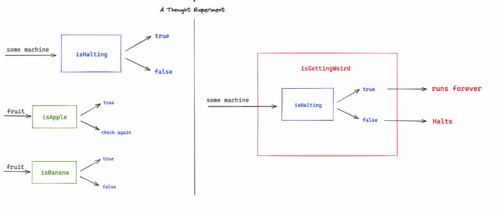
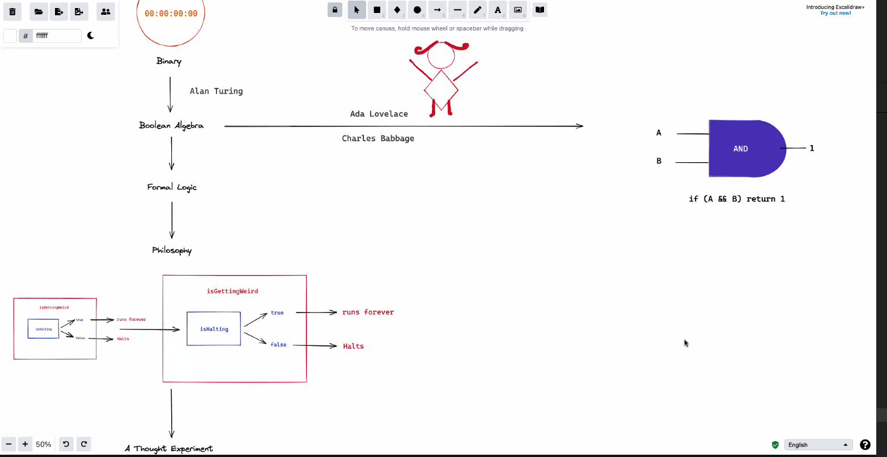
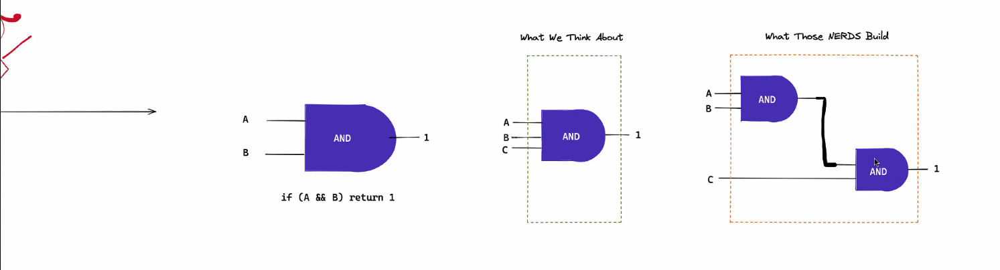

# CompSci 101

## Thought Experiment

[Wikipedia for: Halting Problem](https://en.wikipedia.org/wiki/Halting_problem)

isHalting maching - may run forever

isApple passed to isHalting returns false
* not a halting machine

isBanana passed to isHalting returns true
* a halting machine

### These ideas of macines evolved into Boolean Algebra, Binary, and Logic Gates

    
### Assembly Language and Computer Programming Languages evolved from here

isGettingWeird

    if it evaluates as true
    if we pass isApple to isGettingWeird, ??

    if we pass isGettingWeird to isGettingWeird
        unsolvable
        oscilates b/t true and false

# Boolean Logic

# Computation (CPUs)

# Hash Maps

# OOP

# Problem Solving / Debugging